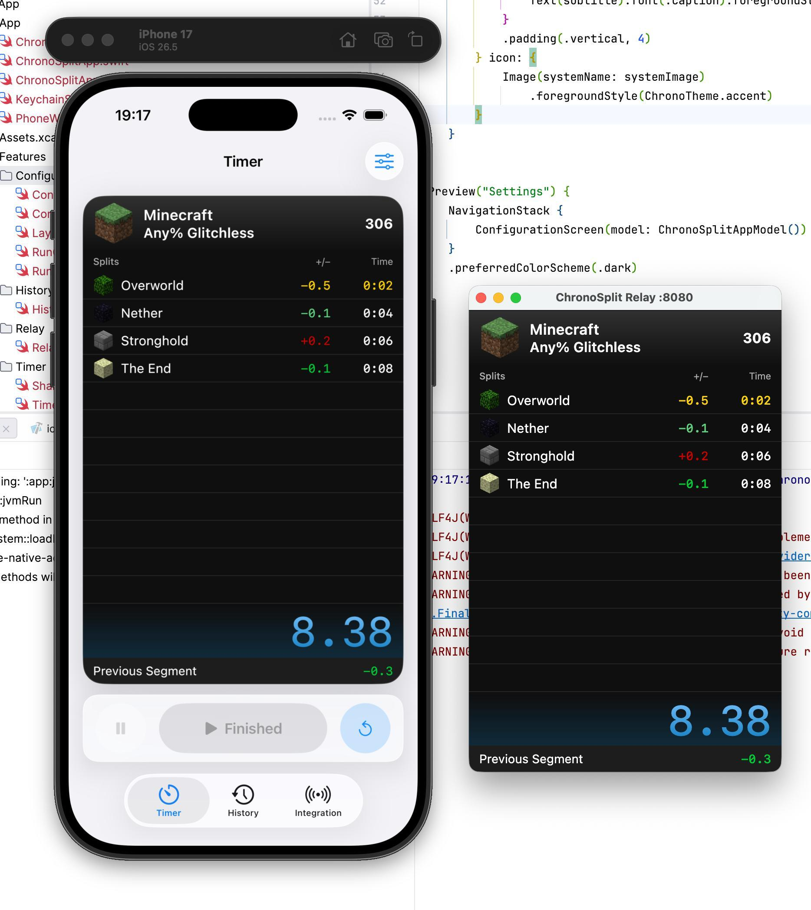

# ChronoSplit

An iOS-first, open-source speedrun timer with LiveSplit file support, an Apple
Watch companion, and a relay display for OBS.

The mobile app is the source of truth for run configuration, timing, and attempt
history. Desktop, browser, and Docker relays only mirror the latest state, so
they can be restarted or replaced without moving ownership of the timer away
from your phone.



> [!NOTE]
> This project contains AI-generated code. See [AI_USAGE.md](AI_USAGE.md) for details.

## Features

- Start, split, pause, resume, and reset runs from iPhone or Android.
- Create and switch between multiple run configurations.
- Edit split names, icons, personal bests, gold times, and the run offset.
- Import and export LiveSplit `.lss` files, including compatible attempt
  history and PNG icons.
- Import, export, preview, and customize LiveSplit One `.ls1l` layouts.
- Store attempt history locally on the mobile device.
- Control the iPhone timer and view its current splits from Apple Watch.
- Publish the current run to a browser or desktop display for OBS.
- Use an optional shared token to authenticate the mobile app with the relay.
- Follow the system light or dark appearance on mobile.

## Platforms

| Platform | Role | Minimum version |
| --- | --- | --- |
| iPhone | Primary timer and configuration app | iOS 18.5 |
| Apple Watch | Companion display and timer controls | watchOS 11.5 |
| Android | Timer, configuration, history, and relay client | Android 15 (API 35) |
| Browser | Read-only remote/OBS display | WebAssembly-capable browser |
| macOS desktop | Read-only display with an embedded relay | Built from source |

## Use ChronoSplit with OBS

The simplest relay setup uses Docker Compose:

```bash
docker compose up --build
```

Then:

1. Open `http://localhost:8080` to verify the remote display.
2. On the phone, open **Integration** and enter the relay URL. When testing on a
   physical phone, use the computer's LAN address, such as
   `http://192.168.1.20:8080`, instead of `localhost`.
3. Connect the mobile app.
4. Add `http://localhost:8080` to OBS as a Browser Source.

The relay keeps only the latest published state in memory. It does not store
your configurations or attempt history.

### Protect the mobile connection

The local relay accepts an unauthenticated mobile connection by default. Set a
token when the relay is reachable by other devices:

```bash
MOBILE_AUTH_TOKEN='choose-a-long-random-token' docker compose up --build
```

Enter the same value in the mobile app's **Integration** screen. The browser
display and `/api/state` endpoint remain read-only but are not authenticated, so
do not expose the built-in relay directly to an untrusted network. Put it behind
an HTTPS reverse proxy when using it outside your LAN.

Only one mobile session can publish to a relay at a time.

## Build from source

ChronoSplit uses Kotlin Multiplatform, Compose Multiplatform, SwiftUI, Room, and
Ktor. Install Eclipse Temurin JDK 25 to build all targets. GraalVM 25 is not
compatible with the Android SDK image transform used by this build.

### Android

Install Android SDK 37, then build the debug APK:

```bash
./gradlew :app:androidApp:assembleDebug
```

The APK is written under `app/androidApp/build/outputs/apk/debug/`.

### iPhone and Apple Watch

Open `app/iosApp/iosApp.xcodeproj` in Xcode, select the `iosApp` scheme, and run
it on a simulator or device. The watch app is embedded in the iOS target and
uses WatchConnectivity to mirror state and send timer controls.

Xcode invokes Gradle to build the `ChronoSplitIosApp` Kotlin framework. Make
sure `JAVA_HOME` points to a valid JDK installation before launching Xcode if
it cannot find Java automatically.

### Desktop relay

Run the macOS desktop display and its embedded relay:

```bash
./gradlew :app:jvmApp:run
```

It listens on port `8080` by default. Override the port or mobile token with the
`HTTP_PORT` and `MOBILE_AUTH_TOKEN` environment variables.

### Web relay without Docker

Build the standalone relay and production web assets:

```bash
./gradlew :backend:installBackend :app:webApp:wasmJsBrowserDistribution
```

Then start the backend from the repository root:

```bash
WEB_ASSETS_DIR=app/webApp/build/dist/wasmJs/productionExecutable \
java -cp 'backend/build/install/backend/lib/*' \
dev.fopwoc.chronosplit.backend.ApplicationKt
```

The web display is available at `http://localhost:8080`.

## Project structure

| Module | Purpose |
| --- | --- |
| `app/appShared` | Shared mobile session, timer domain, relay publishing, and Room history |
| `app/androidApp` | Android app built with Compose and Material 3 |
| `app/iosApp` | Kotlin iOS bridge, native SwiftUI app, and watchOS companion |
| `app/jvmApp` | Compose Desktop display with an embedded Ktor relay |
| `app/webApp` | Compose Multiplatform WebAssembly display |
| `backend` | Standalone JVM relay and web asset server |
| `shared/models` | Run, layout, history, and relay protocol models |
| `shared/compose` | Shared timer board and remote-display UI |
| `shared/server` | Ktor relay routes and in-memory state fan-out |

## License

ChronoSplit is licensed under [WTFNMFPL](LICENSE). See
[THIRD_PARTY.md](THIRD_PARTY.md) for interoperability and provenance notes.
